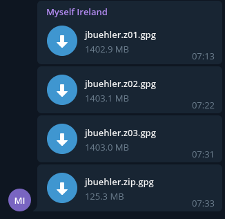
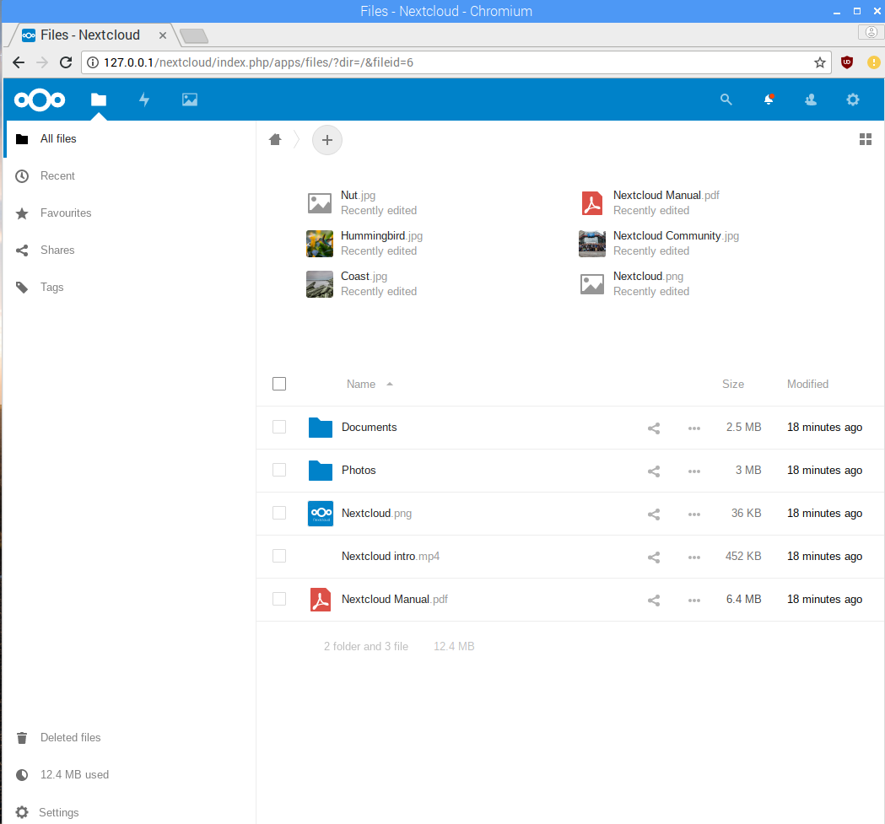

# Nextcloud Server auf Rasperry Pi

## Inhaltsverzeichniss

- 01 - Autoren, Versionierung
- 02 - Funktion des Services
- 03 - Benötigte Hard- und Software
- 04 - Installationsanleitung
- 05 - Testing
- 06 - Übergabe an den Betrieb
- 07 - Quellen
  
    
## Autoren, Versionierung

### Autoren
- Janosch Bühler
- Mike Spengler

### Versionierung
Wir nutzen Github und haben alle Dokumentationen in einem Repository. Dadurch ist die Versionierung duch Git bereits vorgegeben.

### Auftrag
Unser Auftraggeber wünscht sich eine eigene Cloud welcher vor Ort gehosted wird und via Webbrowser verfügbar ist. Diese Cloud wird gewünscht, da der Kunde sensible Daten hat und nicht will, dass diese Daten auf Servern anderer Unternehmen ist. 

## Funktionen von Nextcloud
Nextcloud ist eine Cloudlösung. Diese Cloudlösung kann man einfach auf einem eigenen Computer installieren. Auf dem Computer sollte vorzugsweise eine Linux-Distribution installiert sein. Weil alles lokal auf einem eigenen Server installiert, kann man die Datenintegrität besser gewährleisten.

## Hard- und Softwareanforderungen von Nextcloud
### Hardware
-   Computer (in unserem Fall Raspberry Pi 3)
-   Netzteil (Micro USB)
-   Netzwerk- und Internetverbindung

Ein Raspberry Pi braucht dazu eine Micro SD Karte mit mindestens 4 GB.

### Software
Wir haben ein Raspbian Stretch auf dem Raspberry Pi installiert. Darauf haben wir php7.3 und apache2 installiert. Zudem wurde Nextcloud selber installiert. Die Installation via Snap oder Docker funktioniert nicht oder nur teilweise, da die Architektur dies nicht ermöglicht.

Nextcloud benötigt php und einen anderen Webserver um zu funktionieren.

Softwareanforderungen: 
php7.1
Webserver (apache2, nginx o.ä)

SW-Packages php:
```
php7.3 php7.3-gd php7.3-sqlite3 php7.3-curl php7.3-zip php7.3-xml php7.3-mbstring
```
SW-Packages sql:
```
sqlite
```
SW-Packages apache:
```
libapache2-mod-php7.3
```


## Installation
Um Nextcloud auf dem Raspberry Pi laufen zu lassen, müssen wir zuerst Apache und PHP installieren und einrichten. 

Für die beste Leistung empfehle ich die Verwendung von Raspbian lite, aber auch eine normale Raspbian installation funktioniert gut. Die Installation des Betriebsystems kann im Internet nachgelesen werden falls dies nötig ist.

### Zuerst muss PHP 7.3 und Apache installiert werden

1. Um loszulegen, aktualisieren man zunächst das Paket-Repositorys mit dem folgenden Befehl:
```
sudo apt-get update
sudo apt-get upgrade
```
2. Nachdem das erledigt ist, installieren man nun apache mit dem folgenden Befehl:
```
sudo apt-get install apache2 installieren
```
Man kann überprüfen, ob Apache2 erfolgreich gestartet und ausgeführt wird, indem man im Browser die IP-Adresse seines Pi eingiebt. Dies sollte eine Standard-Apache-Seite laden.

3. Da Apache2 jetzt auf dem Raspberry Pi installiert ist, müssen wir nun PHP und einige der dazugehörigen Pakete installieren. Um php7.3 zu installieren benötigt man Raspian Stretch.

Zuerst erstellt man eine neue Source List: 
```
sudo nano /etc/apt/sources.list.d/10-stretch.list.
```

In dieser Datei fügt man nun folgendes hinzu:
```
deb http://mirrordirector.raspbian.org/raspbian/ stretch main contrib non-free rpi
```
Um PHP und die benötigten Pakete zu installieren, führt man den folgenden Befehl aus.
```
sudo apt-get install php7.3 php7.3-gd sqlite php7.3-sqlite3 php7.3-curl php7.3-zip php7.3-xml php7.3-mbstring libapache2-mod-php7.3
```
5. Module php7.3 für apache aktivieren
```
sudo a2enmod php7.3
```

6. Wenn Apache und PHP jetzt installiert sind, muss man den apache neu starten. Dies kann man mit dem folgenden Befehl tun:
```
sudo service apache2 restart
```


### Installation von Nextcloud

Die Installation von Nextcloud auf dem Raspberry Pi ist ganz einfach, es geht hauptsächlich darum, das Skript von der Website herunterzuladen, das zip zu extrahieren und dann die IP-Adresse im Browser einzugeben.

1. Um loszulegen, wechselt man zuerst in das html-Verzeichnis mit dem folgenden Befehl:
```
cd /var/wwww/html/html
```
2. Jetzt kann man den folgenden Curl-Befehl ausführen, damit man die neueste Version von Nextcloud in einem Schritt herunterladen und extrahieren kann.
```
sudo wget https://download.nextcloud.com/server/releases/nextcloud-17.0.0.zip
sudo unzip nextcloud-17.0.0.zip
```
3. Man muss nun ein Datenverzeichnis für Nextcloud erstellen, in dem man arbeiten kann. Für die Erstinstallation von Nextcloud muss man diesen Ordner im html/nextcloud-Verzeichnis anlegen. Dies geschieht mit dem folgenden Befehl:
```
sudo mkdir -p /var/www/html/nextcloud/data
```
4. Nun gibt man die richtigen Benutzer- und Gruppenkontrolle über den gesamten Nextcloud-Ordner und alles, was sich darin befindet, durch Ausführen des folgenden Befehls.
```
sudo chown -R www-data:www-data /var/www/html/nextcloud/d
```
5. Schließlich muss man dem Benutzer die richtigen Berechtigungen geben und erneut den folgenden Befehl ausführen:
```
sudo chmod 750 /var/www/html/nextcloud/data
```
6. Nachdem man damit fertig ist, können wir nun endlich zu Nextcloud selbst gehen und den Installationsprozess beginnen. Um zu beginnen, geht man zu der IP-Adresse von Raspberry Pi plus /nextcloud.

Dabei muss man daran denken, dass man die IP Adresse durch die eigene ersetzen muss.
```
192.168.1.12/nextcloud
```
7. Man wird nun mit dem folgenden Bildschirm begrüßt. Hier muss man den Benutzernamen und das Passwort (1.) eingeben, die man für das Admin-Konto verwenden möchten. Wenn man plant, den Nextcloud-Dateidienst von außerhalb des Netzwerks zugänglich zu machen, muss man sicherstellen, dass man ein langes und sicheres Passwort verwendt.

Wenn man damit zufrieden ist, drückt man die Taste "Finish Setup" (2.), dabei muss man beachten, dass dies einige Zeit dauern kann, bis das Setup abgeschlossen ist.


### Backup über Telegram
Nextcloud ist nur ein Synchronisierungservice und kein Backup. Um einen Datenverlust zu vermeiden sollte man die Daten auf einen externen Dienst oder eine externe Festplatte backuppen. 

Der Instant-Messaging Dienst Telegram bietet unlimitiert Speicherplatz für seine Benutzer an. Das Benutzen des Dienstes ist kostenlos. Telegram gilt als einer der sichersten Instant-Messaging Dienste. Trotzdem sollte man die Dateien, die man auf Telegram hochlädt verschlüsseln, da Telegram V-Server von Amazon und von Google benutzt.

Um das Backup über Telegram zu realisieren muss man noch einiges wissen. 
- Die maximale Dateigrösse für Telegram ist 1.4GB
- Der Uploadspeed auf Telegram ist nicht sehr hoch (~5MB/s)
- Mehrere Uploads gleichzeitig können zu Fehlern führen. 
- Die Dateien sollten immer verschlüsselt hochgeladen werden.
- Es gibt ein CLI-Interface für Telegram unter Linux (telegram-cli)

Aus diesem Grund sollte man aus den Dateien zuerst eine ZIP-Datei erstellen, welche dann hochgeladen werden. Bei ZIP kann man eine maximale Dateigrösse angeben, welche nicht überschritten werden soll. Die Dateien werden durch GPG verschlüsselt, welches auf vielen Linux-Distributionen bereits installiert ist. Schlussendlich werden sie hochgeladen über das CLI-Tool telegram-cli. 

Telegram-cli kann sehr einfach installiert werden. Zuerst muss man snap installieren, über welches man danach telegram-cli installieren kann.
```
sudo apt install snapd
```
Nun kann man telegram-cli ganz einfach installieren.
```
sudo snap install telegram-cli
```
telegram-cli ist nun installiert. Initial muss man sich jedoch noch mit der Handynummer und einem an diese Handynummer geschickten Code anmelden. Ins Commandlineinterface von telegram-cli kommt man ganz einfach indem man folgendes eingibt:
```
telegram-cli
```
Nun kann man über das CLI (fast) alle Funktionen von Telegram benutzen. 

Für das automatische Backup über Telegram haben wir ein einfaches Bash-Script geschrieben:
```
BACKUP_FOLDER=/var/www/html/nextcloud/data/USER/files/
TEMP_FOLDER=/tmp/backup/
ZIP_NAME=USER.zip
PASSWORD=PASSWORT

mkdir $TEMP_FOLDER
rm -r $TEMP_FOLDER/*
zip -r -s 1400m $TEMP_FOLDER$ZIP_NAME $BACKUP_FOLDER
for FILE in $TEMP_FOLDER*
    do
        echo $PASSWORD | gpg -c --batch --yes --passphrase-fd 0 $FILE 
        rm $FILE
        /snap/bin/telegram-cli -W server.pub -e "send_file Backup $FILE.gpg"
        rm $FILE.gpg
    done
rm -r $TEMP_FOLDER
```
Im obenstehenden Script müssen die 4 Variablen noch angepasst werden.

Um das Script nun in regelmässigen Abständen ausführen zu können wird ein Cronjob erstellt. Als root kann man unter Linux standardmässig einfach Cronjobs mit ``crontab -e`` erstellen.

Der Cronjob sieht auf unserem Raspberry Pi wie folgt aus:
```
# To define the time you can provide concrete values for
# minute (m), hour (h), day of month (dom), month (mon),
# and day of week (dow) or use '*' in these fields (for 'any').
0 7 * * * /root/backup_telegram/backup_template.sh
```
Unter Umständen muss der Pfad noch angepast werden und die Zeit sollte wie gewünscht festgelegt werden. In unserem Beispiel wird das Script jeden Tag um genau 7 Uhr morgens ausgeführt.


## Testing von Nextcloud

| Testfall                                                        | Soll                                                                               | Ist                                                                                           |
|-----------------------------------------------------------------|------------------------------------------------------------------------------------|-----------------------------------------------------------------------------------------------|
| Im Browser wird die IP des Raspberry Pi eingegeben                | Das Login Fenster von Nextcloud erscheint und man kann sich in der Cloud einloggen | Im Browser erscheint das Loginfenster von Nextcloud und ermöglicht das Einloggen in die Cloud |
| Im Loginfenster von Nextcloud die falschen Logindaten eingeben  | Nextcloud gibt eine Meldung, dass die Logindaten falsch sind                       | Nextcloud verweigert das Login und meldet, dass das Login falsch ist                          |
| Im Loginfenster von Nextcloud die richtigen Logindaten eingeben | Das Login ist erfolgreich und man erhält Zugriff auf die Cloud                     | Das Login ist erfolgreich und man erhält Zugriff auf seine Cloud                              |
| Hochladen eines Files                                           | Das File wird auf Nextcloud hochgeladen und erscheint in der Cloud                 | Das File wird auf den Nextcloud Server geladen und wird in der Cloud gespeichert              |
| Download eines Files                                            | Das File wird heruntergeladen und man kann es auf dem Computer nutzen              | Der Download des Files beginnt und man kann das File nach dem Download nutzen                 |
| Synchronisierung durch Sync Client | Die Dateien werden korrekt und automatisch synchronisiert | Die Synchronisierung funktioniert. Jedoch dauert es relativ lang, bis der Synchronisierungsvorgang angestossen wird. 
| Fehlermeldungen in Logs | Die Logs melden keine Fehlermeldungen | Es gibt nur eine einzige Warnung, die aber nicht in den Logs erscheint und nur bei der initialen Konfiguration. Diese Warnung ist, dass sqlite als Datenbank verwendet wird und nicht eine stabilere, zuverlässigere Datenbank. 
| User erstellen | Der User wird erstellt und man kann die maximale Datenmenge angeben, die dieser User zur verfügung hat. | Man kann den User erstellen und angeben, wieviel Speicherplatz dieser User zur verfügung haben soll.
| Installieren von zusätzlichen apps | Zusätzliche Apps können installiert werden und diese Funktionieren auch | Das Installieren von zusätzlichen Apps funktioniert und die installierten Apps funktionieren auch.
| Themes | Themeing app ist installiert und themes können erstellt sowie angepasst und applied werden. | Über die Themeingapp können können themes erstellt werden. Diese themes können dann auc beabeitet und applied werden. 
| Telegram Backup | Das Backup über Telegram funktioniert via Cron | Das Backup funktioniert aber hat ziemlich lange, da unser Raspberry Pi sehr langsam ist. s


Im Screenshot sind Testdateien zu sehen die wir in die Cloud geladen haben.



Wir haben aktuell 2 Logins erstellt. Der Kunde wird sich dann selber seine Logins erstellen können.


## Übergabe an den Betrieb
DIe Übergabe wurde in einem Separatem Dokument gehandhabt. 

## Quellen

- https://raspberrytips.com/install-nextcloud-raspberry-pi/
- https://getgrav.org/blog/raspberrypi-nginx-php7-dev
- https://linuxhint.com/install_nextcloud_raspberry_pi/
- 